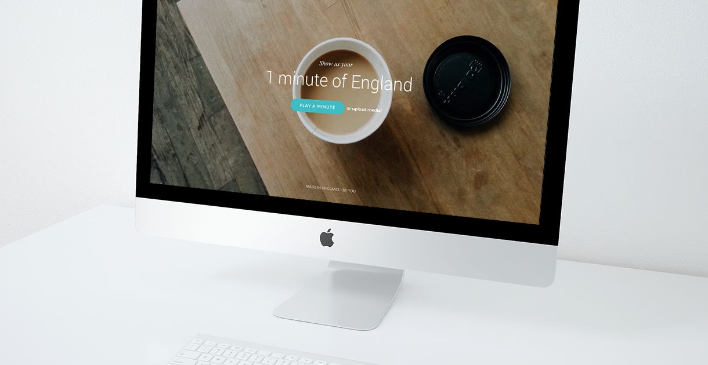

This part is really just here to say that I continued the Englishness application from my last semeser. The development of the project <a href="https://magnuss.carbonmade.com/projects/5396219" class="mark">can be found on my old univeristy portfolio</a>. This article will be short, and I will only focus on what changed from the previous site. The release date is currently unkown.

<blockquote class="entry">
	
This is a web application for users to show their favourite part of England

</blockquote>

In order to upload content to the site, I had to explore PHP. PHP is fairly easy, but it's also the first step into computer programming --- a language and syntax very different to scripting languages like JavaScript. At the time of writing, I'm still developing the application, but it's quintessentially allowing uploads to the host server, and dropping said uploads to a dedicated folder, named "Uploads".

PHP file uploads was quite <a href="http://www.w3schools.com/php/php_file_upload.asp" target="_blank">straight forward</a>. I can easily set a maximum file upload, specific file types and rename files if they already exist in the database. I would have liked to automate the process of editing, compressing and uploading the files again, but due to the user-driven nature of the content, moderation would be mandatory.

As this project moved from being an iOS application to a web application, it needed a new user interface. The site now featured two primary aspects: uploading content and consuming content, and I wanted to make this as simple as possible. The call-to-action button will now play the video via <a href="http://www.videojs.com/" target="_blank">video.js</a> for deeper browser support. The user can upload by scrolling down and dragging their own content into the browser, as instructed on the website.

## Reflection and continuation

I would have loved to spend more time on this project, but time was simply too precious with university projects and other paid work --- <a href="/uni-workflow" class="mark">as outlined in my university workflow article</a>. I'm still keeping in touch with the client, and this is hopefully something I can find time to continue developing after my university deadlines.

