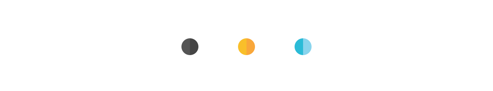
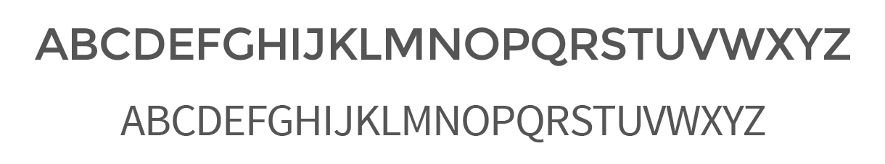

	<a href="http://transmedia-show.co.uk/" class="button" target="_blank">Live site</a>

Ah, Transmedia --- it had its own module last semester, but it felt more like a secondary project to everything else this semester. We had to find the time to prepare outside lectures, and demonstrate our understanding and skill in time- and project management --- exciting, yet I'm sure it was terrifying for some of us.

For the sake of formality, Transmedia is an annual event held in association with the University of Winchester. Its intention is for digital media students at the Digital Media Design &amp; Development course to engage and interact with industry, and hopefully secure jobs or potential clients. In other words, we try to kickstart student careers into the digital media industry! For the record, I worked on the website for this event.

<blockquote class="entry">
	
Transmedia is meant to kickstart digital media careers.

</blockquote>

As this is a follow-up to my last semester, and not a part of my core modules for this semester, I will keep it brief. The primary focus will be the things that changed from the <a href="http://magnuss.carbonmade.com/projects/5396235" target="_blank" class="mark">established brand and website</a>.

The initial approach felt like a draft --- a product with set intentions, but bent to please incomplete feedback. The design died, and a better approach would have been to scrap it and start over. The solution was obvious: create the website from the ground up, with student feedback in mind and a clear goal. The goal was to get it right this time.

## Alterations

Design has changed, but not much. With help, I redesigned the characters to have richer details and more personality --- reflecting the event's theme and activities. I removed heavy elements, such as a full section dedicated to Google Maps and replaced it with a simple link. Limited but valuable testing showed a preference for the Google Maps application itself over the on-site experience. It also kept the page lighter and we no longer had to rely on this particular third party element on the site itself.

It might not be as obvious at first, but the code changed quite a lot from the initial website to this one. It's cleaner with less repetition, minified and generally less bloated than it used to be. It's one of the perks of coding a predetermined design --- your code will generally be cleaner when you're not making design changes along the way.

## Impression

I'm not known for working with a lot of different colours. This is intentional, because I want a colour to mean something, rather than just picking aesthetics based on emotions and what I personally like. A fellow student and I worked on the brand through Q4 of 2014, and as it was established as playful, it desperately needed more striking colour contrasts.

I wanted to maintain the simple layout, and therefore the colours had to complement each other and not appear out of place. The primary UI colours are offblack (grey), offwhite (light grey) and blue. Nothing is ever completely black in real life, and unless something is overexposed it's not completely white either. The shades are kept for legibility and a greater user experience, as harsh contrasts are unpleasant to read. The highlight colour, blue, is there to draw attention to itself in the otherwise empty landscape for quick and effective communication.

As for the graphical elements, we ensured a strong brand by mixing complementary colours, close to complementary colours or mixing neutral shades of colours with stronger colours for a pleasing contrast. Different shades of the same colour are also used to add details or depth while keeping the design flat.

<ul class="show">
	<li>
		
	</li>
	<li>
		
	</li>
	<li>
		
	</li>
	<li>
		
	</li>
</ul>

## Legibility

The established brand font was Montserrat, yet the body copy was largely undecided. I kept Montserrat for the header, and went for Source Sans Pro for the body text. It's a neutral font and primarily intended for user interfaces. However, the x-height allows for a pleasant reading experience -- even at longer paragraphs.

We're keeping the paragraphs between 50 and 90 characters per line, which is admittedly on the heavier side of things, but justified by having scan-able headlines for essential information and dynamic font sizes for larger monitors.

## Growing up

The site was rebuilt from the ground up, keeping merely the layout and the initial spacing between sections from the first layout. Everything else changed to compensate for the new identity. I did admittedly play around with different layouts over the holidays after receiving feedback from a fresh pair of eyes, but I figured the best approach would be to expand on the existing layout to respect everyone else's effort.

The site itself is built as a static site with HTML, Sass, JavaScript and jQuery. A content management system felt redundant for a site of this scale, and with mobile web browsing on the rise, loading speed was important. We found no justification for a CMS, and when the Transmedia brand changes from year to year, the answer was even clearer.

I wrote <a href="http://transmedia-show.co.uk/getting-there/" class="mark" target="_blank">a more tech heavy explanation</a> on the actual Transmedia website. It's hidden in the source code as an easter egg for those who bothered to inspect our code. I found it clever at least:

	Thank you for your interest in the source code.
	As you've gotten this far, I'm assuming you're
	interested in how it was made:

	www.transmedia-show.co.uk/getting-there

## Other directions

I also explored the idea of using different colours, but as the brand was already established and not a part of our core modules this semester, it felt inappropriate. Expecting my peers to use their free time to discuss design changes would not only be asking too much, but also disrespectful given their efforts last semester. I settled upon tweaking the existing brand slightly --- without drastic changes like <a href="../img/tm/png_04.png" target="_blank">this concept</a> or the ones below:

	
	Colour change and font change

	
	Colour tweaked slightly, new font and design tweaks

## Potential

Given more time, I'd prioritise making the site even lighter and serve different images for different pixel densities. The graphics could also be turned into scalable vector graphics instead of traditional lossy JPEGs. It's also worth mentioning the possibilities of establishing a set Transmedia brand --- and in that case, a content management system would be the obvious way to go. However, judging by previous events and personal experience, I believe students enjoy the process of designing a new identity for each show.

## Conclusion

I'm very happy with the outcome of this particular project. It feels up to date, and something I'd be proud to bring up in a job interview. I also have <a href="/case-exhibition">pictures from the day</a> if you're interested in that sort of thing.

