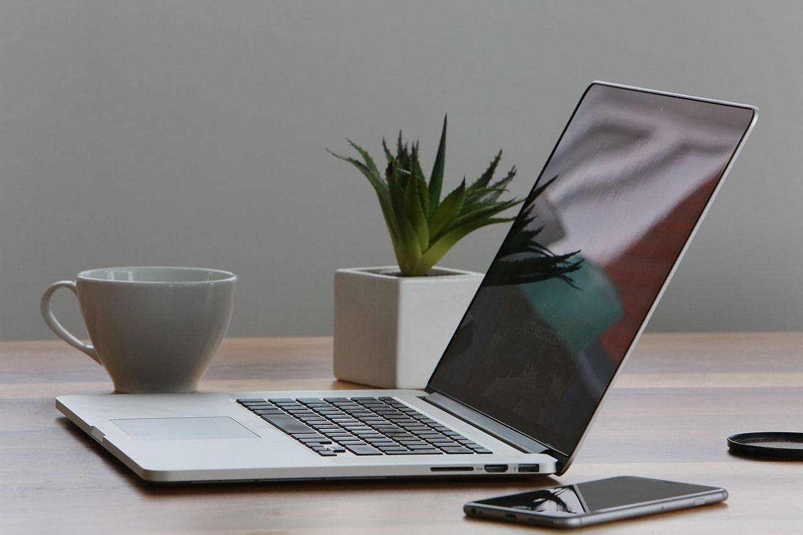

## Average week

This has honestly been the busiest semester so far, and time management has been key to getting through it. I keep track of my work, priorities, university assignments and deadlines on my Calendar app, and I sync it across my devices with iCloud. This is however all in Norwegian (shown below) and contains some private information (not shown below), so I've translated the university section of it to English, and compiled it below.

	
	I keep track of deadlines, events and priorities in my Calendar application on a day-by-day or week-by-week basis.

I'm mostly taking one day at a time on a priority-to-priority basis. This basically means that the closest deadline has the highest priority. This allows me to focus and dedicate full days to a single project. With several deadlines on the same day however, multitasking becomes mandatory, and I might have to outline a plan for the entire week. I've found planning as I go to be a better way than planning months ahead --- it's a personal preference, and it adds a sense of freedom because it puts less perceived pressure on me.

**Mondays** are primarily dedicated to my job. I work from 09:00 to 17:00, excluding the journey back and forth --- which adds another hour or so to the day. The evenings are dedicated to lecture preparations and anything else that might be due the next day. If nothing requires immediate preparations, I will work on the top project of my priority list.

**Tuesdays** are primarily dedicated to lectures --- from 10:00 to 17:30. I usually have spare time in the evening, which allows me to work on whatever my current top priority is.

**Wednesdays** are similar to Mondays.

**Thursdays** are similar to Tuesdays.

**Fridays** are similar to Wednesdays, but as I (usually) have nothing mandatory to attend the next day, so I can spend more time on a project as sleep can be postponed by several hours.

**Weekends** are great for productivity as I can get up early and work through the day with no interruptions. I usually spend this time to catch up on university work, as the average week only allows for a few hours every evening to do so -- which greatly affects my self-study hours.

	
	Simplified but accurate representation of the average weekday.

**Other deadlines** will have priority over everyday work and assignments, and will automatically jump to the top of my priority list. This has been events like the Transmedia show approaching and my take-away exam. This comes before my job as well. As for emails, I don't get enough of them to have a dedicated time slot to reply, but I have a strict policy of not replying or sending emails after 21:00 to clients.

## Priorities

Throughout the semester, I had different priorities every week. I plan day by day, but for the sake of clarity I've decided to list my priorities week by week instead.

**Week 1** --- Plan for the semester.

**Week 2** --- Establish connection with clients, and set up milestones.

**Week 3** --- Written proposal for group project. Started new job.

**Week 4** --- New job. Understand and get familiar with Jekyll.

**Week 5** --- Personal website design and development.

**Week 6** --- Social media campaign preparations. Personal website development and polish.

**Week 7** --- Social media campaign launch. Transmedia website updates.

**Week 8** --- Social media campaign maintenance. Transmedia preparations. Business idea presentation and end of year show.

**Week 9** --- Client projects. Social media campaign maintenance. Catch-up. Take-away exam preparations.

**Week 10** --- Take-away exam. Crit review for group project. Case-study presentation submission. Work arrangement for upcoming weeks. NLT.

**Week 11** --- Animations. University portfolio updates.

**Week 12** --- Group presentation. Social media presentation. Case-study presentation. Polish, compile and submit everything due for April 3rd.

**April and May** --- Case-study. Year 3 business plan and NLT revision. Process report.

## How I work

I usually start off with a brainstorming session and bare bones basic sketches to visualise my thinking. In fact, <a href="/sketchbook" class="mark">I wrote some articles on sketching</a>, which reflects how I work. The sketches don't have to be great, but as long as I can reference them to understand where every element of a website came from, I can demonstrate their relevance and show what I need to do to hit certain milestones. It's quick, dirty and efficient for initial layouts and wireframes.

It's appropriate to mention Photoshop here and why I don't use it as much as I used to -- at least for web design. It feels dated and tedious to do mockups in Photoshop when responsive design has become the norm. I see nothing wrong in creating a look and feel in Photoshop, UX Pin, Sketch or any other prototyping tool, but laying out a complete website and the individual pages seems inefficient to me unless your client is a big part of the design process. There are certainly benefits to doing both, and in my experience, it really depends on the type of project and the type of client you're working with.

I like to work with lists, which means I can capture ideas in a sentence or two and easily outline thoughts on the go or whenever creativity strikes. Below are some sketches for this website, the end of year show, and my social media campaign.

<ul class="show">
	<li></li>
	<li></li>
	<li></li>
	<li></li>
	<li></li>
	<li></li>
	<li></li>
	<li></li>
	<li></li>
	<li></li>
	<li></li>
	<li></li>
</ul>

## Efficiency

It's easy to mistake efficiency for laziness, but I think it should be looked at differently. By being efficient it means you took the time to learn how to work quickly. This is what I have been trying to do, and for web <a href="https://github.com/partcoffee/snap" target="_blank" class="mark">I'm sharing it for people to use at GitHub</a>. There is also the possibility of bigger frameworks, but for smaller projects I think it might be too much. <a href="/case-framework" target="_blank" class="mark">I actually wrote an article on this subject as well.</a>

I also run a number of automated scripts to speed up my workflow. This is essentially for tasks I find myself repeating, like setting up servers, uploading, downloading and doing backups. These scripts are stored locally on my computer, and allows for quick access to anything from the command line. I should also mention that these shortcuts work for me and is a work-in-progress project, evolving as I evolve. These are a few of the scripts I have defined in my `.bash_profile` file:

	// Backs up my website to Dropbox
	backup() {
	    cp -R ~/dev-site ~/Dropbox/"dev-site-`date`"
	}

	// Run Jekyll server and open Sublime Text
	subjserver() {
	    open $1 -a "Sublime Text 2"
	    cd $1
	    jekyll serve
	    cd ~/Desktop/Web
	}

	// NPM Live Reload server and open project in Sublime
	subserver() {
	    open $1 -a "Sublime Text 2"
	    cd $1
	    live-server
	    cd ~/Desktop/Web
	}

	// Start local python server
	simple-server() {
	    cd $1
	    open 'http://localhost:8000/' -a "Google Chrome"
	    python -m SimpleHTTPServer 8000
	    cd ~/Desktop/Web
	}

	// Open a project in every browser for testing
	bw() {
	    open $1/index.html  -a "Google Chrome"
	    open $1/index.html  -a "Safari"
	    open $1/index.html  -a "Firefox"
	}

	// New project from my personal boilerplate
	new() {
	    cp -R ~/Desktop/Web/snap ~/Desktop/Web/$1
	    open ~/Desktop/Web/$1 -a "Sublime Text 2"
	    cd ~/Desktop/Web/$1/css
	    sass --watch style.scss:style.css --style compressed
	    cd ~/Desktop/Web
	}

	// Get IP address 
	ip() {
	    ipconfig getifaddr en1
	}

	// The IP address allows for wireless testing on mobile devices when I have a server running, without having to upload or rely on the rough estimate of a browser resize.

## Reflection and conclusion

My workflow is very much organic. It's a journey to discover and develop a design fit for a specific target audience, medium and task. At work, I'm mostly working with prototyping tools to visualise ideas --- it's cloud based and open for anyone to adjust, and seems to be effective. I'm sure my workflow can be improved, and I'm sure I will discover new and more efficient ways to work in the future.

In terms of time management, synchronising my calendar across all my devices gave me peace of mind. I work well under pressure, but I struggle with too much pressure. There is a fine balance, and by not overwhelming my brain with stuff that "I should be doing", I can work focused and determined. Unusual perhaps, but it's been working well this semester --- perhaps something worth reviewing over the summer.

This has been the busiest year of my university experience, and I underestimated it. I believe I learned how to say "no" this semester, as I had to turn down several jobs along the way --- which was a shame, because they were interesting, paid and up my alley. I passed some of them on to students and friends, and rescheduled others so I could get back to them at a later date.

To summarise; this works for me: plan ahead, but not too far ahead.

